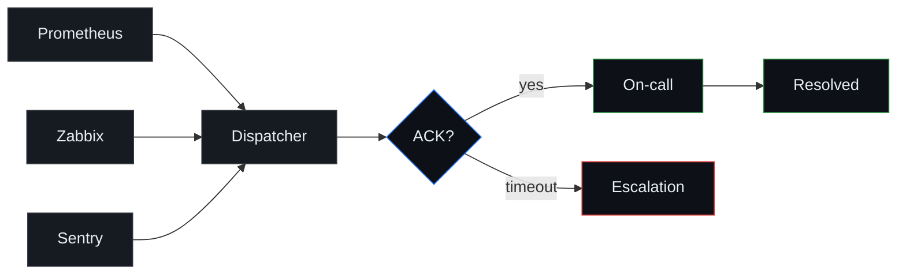
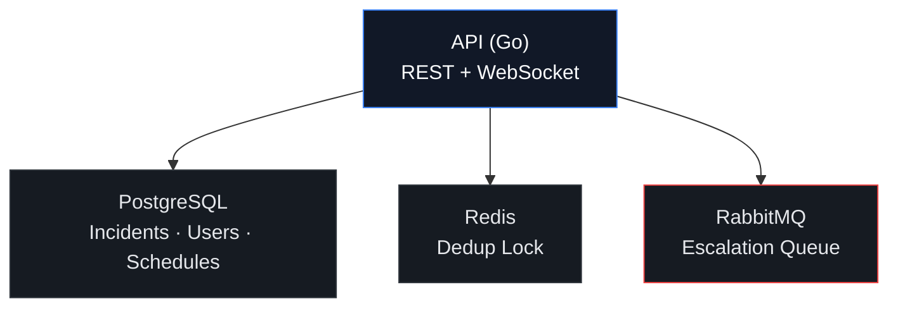

<p align="center">
  
</p>
<div align="center">

  **Self-hosted incident management. API-first. No SaaS. No noise.**

[](https://www.gnu.org/licenses/agpl-3.0)
[](https://golang.org)
[](https://postgresql.org)
[]()
[](https://gitlab.com/dispatcher-api/dispatcher)

 ⭐ **Star this repo** if you find it useful — and follow the project on **[GitLab](https://gitlab.com/dispatcher-api/dispatcher)** where the actual code lives.

</div>

---

## What is Dispatcher?

Dispatcher is a middleware service between your monitoring systems and your on-call engineers.

It takes a chaotic stream of raw alerts and turns them into **one actionable incident**, routes it to **the right person**, and **automatically escalates** if they don't respond — all without manager involvement.



### Without Dispatcher

> 14:00 — database goes down. Prometheus fires 50 alerts.  
> Engineer Bob gets 50 notifications.  
> He spends 10 minutes figuring out it's the same problem.

### With Dispatcher

> 14:00:15 — 50 alerts arrive. One fingerprint. **One incident #INC-2041.**  
> One notification to the on-call.  
> 14:05:00 — no response? Auto-escalated to the next engineer.  
> 14:06:00 — acknowledged. All timestamps recorded.

**50 alerts → 1 incident → 1 notification. Automatic escalation. Accurate reports.**

---

## 📦 Where is the code?

> **This GitHub repo is the project's public page and mirror.**  
> All development happens on **[GitLab →](https://gitlab.com/YOUR_USERNAME/dispatcher)**

| What | Where |
|---|---|
| ⭐ Stars & visibility | **GitHub** (you're here) |
| 🔧 Source code | **[GitLab](https://gitlab.com/dispatcher-api/dispatcher)** |
| 🐛 Issues & roadmap | **[GitLab Issues](https://gitlab.com/dispatcher-api/dispatcher/-/boards)** |
| 💬 Community | **[Discord]** |

---

## Core Features

| Feature | Description |
|---|---|
| **Alert Grouping** | Groups alerts by fingerprint hash (source + server + cluster). 50 alerts become 1 incident |
| **Smart Routing** | Checks the on-call schedule in real time and notifies the right engineer |
| **Auto-Escalation** | If no acknowledgment in 5 minutes — escalates to the next person in the chain |
| **MTTA / SLA Tracking** | Records every timestamp. Reports show exactly who responded when |
| **On-Call Schedules** | Monthly rotations, shift assignments, fingerprint-based responsibility splitting |
| **Multi-source** | Prometheus, Zabbix, Sentry — any system that can send a webhook |

---

## Tech Stack



- **Go** — API server and escalation consumer
- **PostgreSQL** — incidents, users, schedules, reports
- **Redis** — SETNX deduplication lock (prevents race conditions on parallel alerts)
- **RabbitMQ** — delayed escalation queue with `x-delay` plugin (precise 5-min timers, survives restarts)
- **WebSocket** — real-time broadcast to all connected dashboard clients

---

## How It Works

### 1. Alert arrives

```http
POST /v1/alerts
Content-Type: application/json

{
  "alerts": [{
    "source": "prometheus",
    "name": "HighCPU",
    "severity": "critical",
    "labels": { "server": "db-master-01", "cluster": "prod" },
    "annotations": { "description": "CPU usage is 95% on db-master-01" },
    "timestamp": "2026-04-18T14:00:15Z"
  }]
}
```

### 2. Fingerprint computed

```
fingerprint = SHA256("prometheus" + "db-master-01" + "prod")
```

`name` and `timestamp` are intentionally excluded — HighCPU and DiskFull on the same server is **one problem**.

### 3. Deduplication lock (Redis SETNX)

```
SETNX lock:fingerprint:<hash> 1 EX 30
```

Prevents two parallel alerts from creating two incidents.

### 4. Incident created or updated

- **New fingerprint** → create incident, notify on-call, queue escalation in RabbitMQ
- **Existing fingerprint** → increment `alert_count`, broadcast WebSocket update

### 5. Escalation consumer

RabbitMQ delivers the message after exactly 5 minutes:

```python
if incident.status == "acknowledged": return  # Engineer responded in time
if incident.status == "resolved":    return  # Already closed
# Escalate to next step
notify(next_user, incident)
queue_next_escalation(incident, step + 1)
```

---

## Incident Lifecycle


> Transition from `resolved` back to `open` is not allowed.  
> If the problem returns — a new incident is created.

---

## Getting Started

### Prerequisites

- Docker & Docker Compose
- Go 1.26+ (for local development)

### Run with Docker Compose

```
*coming soon*
```

> Full setup guide and Docker Compose file are in the **[GitLab repo](https://gitlab.com/dispatcher-api/dispatcher)**.

---

## API Reference

| Method | Endpoint | Description |
|---|---|---|
| `POST` | `/v1/alerts` | Ingest alerts from monitoring systems |
| `GET` | `/v1/incidents` | List incidents (filterable by status, severity) |
| `GET` | `/v1/incidents/{id}` | Get incident details |
| `POST` | `/v1/incidents/{id}/acknowledge` | Acknowledge an incident |
| `POST` | `/v1/incidents/{id}/resolve` | Resolve an incident |
| `GET` | `/v1/schedules/now` | Get current on-call engineer |
| `POST` | `/v1/schedules` | Create a shift |
| `GET` | `/v1/reports/sla` | SLA and MTTA report data |
| `WS` | `/ws` | WebSocket connection for live updates |

---

## 🚀 Beta Program

The first **10 beta testers** will receive **3 months of free access** to the full API + UI after MVP launch.

To apply: *[form link — coming soon]*

---

## License

Dispatcher core is licensed under **[AGPL-3.0](LICENSE)**.

- ✅ Free to self-host
- ✅ Open source forever
- 💼 Paid UI coming with the full MVP

---

## Contributing

Issues, ideas, and PRs are welcome — **[open them on GitLab](https://gitlab.com/dispatcher-api/dispatcher/-/boards)**.

- **Bugs** → [GitLab Issues](https://gitlab.com/dispatcher-api/dispatcher/-/boards)
- **Feature ideas** → [Discord] → `#💡-feature-requests`
- **Questions** → Discord `#❓-help`

---

<div align="center">

Built by **Oshan** · Solo developer · Open-source believer

*Let's build the best self-hosted incident management. Together.* 🚀

**[→ GitLab repo with full source code](https://gitlab.com/dispatcher-api/dispatcher)**

</div>
